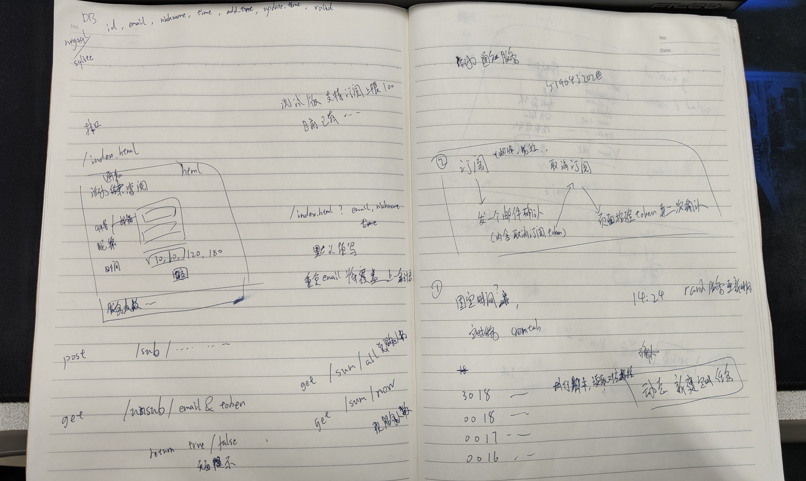

# MLTD_EventNotificationService

灵感来自群友，其实最小的实现没几行代码就可以完成。不过想做一个完成度高一点的东西

快春节放假了，上班使劲摸鱼，做点有“意义”的事（

设计如下图

web框架借助FastAPI实现前后端分离，只需要最小一个表单页面即可。

提交订阅、取消订阅直接发送对应请求。取消订阅与修改订阅从平时发的邮件（附带token）进入，校验token，修改订阅复用表单页面填上先前的参数，允许修改时间或昵称，提交表单复用订阅接口，修改对应数据。

上述方案，最快半天应该也能完成。不过一些细节可能要琢磨一下

## 其他点

1. 数据库方案选择（mysql密码可能忘了、sqlite？）
2. 定时任务的方案，crontab？未来开发折返提醒或者某种通用提醒的形式 希望是尽可能少改动的方案？
3. 抗网络波动的设计
4. sib邮件服务的充分使用（别人订阅服务后，触发加入联系人？），300封每天的上限(记得别把key传上来)